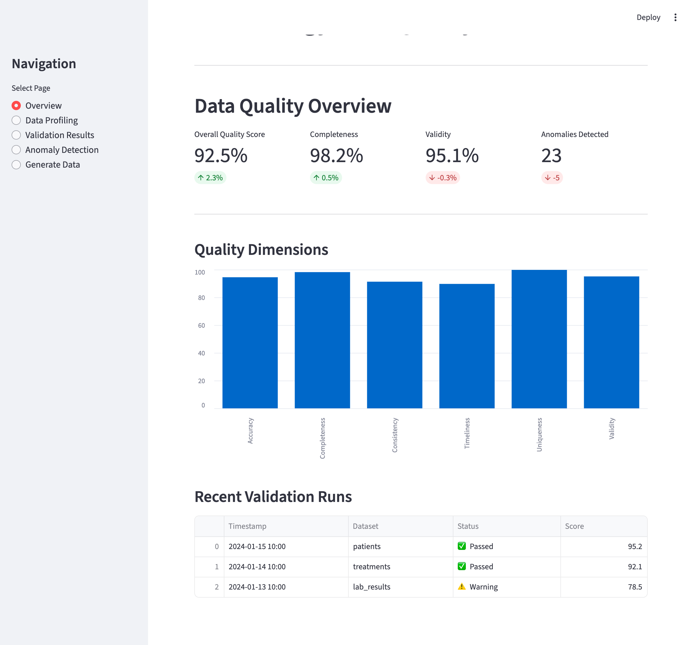

# Oncology Data Pipeline - Data Quality Automation Framework

[](https://www.python.org/downloads/)
[](https://github.com/psf/black)
[](http://mypy-lang.org/)
[](https://greatexpectations.io/)

A production-grade **Data Quality Automation Framework** for healthcare oncology data pipelines. This framework demonstrates expertise in:

- **Great Expectations** for data validation and quality checks
- **Databricks** and **SQL Server** connectivity
- **Python** and **SQL** for data engineering
- **Healthcare data validation** (ICD-10, NDC codes, oncology-specific rules)
- **Data profiling** and **anomaly detection**
- **Test automation** and **CI/CD** integration

---

## Features

### Data Quality (Great Expectations)
- Pre-built expectation suites for oncology data domains
- Checkpoint-based validation workflows
- Automated data documentation generation
- Custom expectations for healthcare standards

### Multi-Platform Connectivity
- **Databricks** connector with Delta Lake support
- **SQL Server** connector with connection pooling
- Factory pattern for seamless backend switching
- Context managers for safe connection handling

### Synthetic Data Generation
- Realistic patient demographics
- Oncology treatment records (chemotherapy, radiation, surgery)
- Lab results with clinically valid ranges
- Configurable data volumes for testing

### Data Profiling & Anomaly Detection
- Statistical profiling with automated reports
- Multi-method anomaly detection (IQR, Z-score, Isolation Forest)
- Schema and data drift monitoring
- Cross-dataset relationship analysis

### Quality Metrics & Dashboards
- Data Quality Index (DQI) scoring
- Dimension metrics (completeness, accuracy, consistency, timeliness)
- Historical trend tracking
- Interactive Streamlit dashboard

#### Dashboard Preview

Launch the dashboard with:
```bash
python -m src.cli dashboard
```



**Dashboard Features:**
| Page | Description |
|------|-------------|
| **Overview** | Quality scores, dimension metrics, validation history |
| **Data Profiling** | Upload CSV files for statistical analysis |
| **Validation Results** | View pass/fail status per expectation |
| **Anomaly Detection** | Configure detection methods (IQR, Z-score, Isolation Forest) |
| **Generate Data** | Create synthetic oncology data with download options |

### Test Automation
- Pytest-based framework with fixtures
- Unit, integration, and E2E tests
- 80%+ code coverage requirement
- Parameterized testing for data scenarios

---

## Great Expectations: How It Works

Great Expectations (GE) is an open-source data quality framework that enables teams to validate, document, and profile data. This project implements GE following production best practices.

### Core Concepts

```
┌─────────────────────────────────────────────────────────────────────────────┐
│                        GREAT EXPECTATIONS WORKFLOW                          │
├─────────────────────────────────────────────────────────────────────────────┤
│                                                                             │
│   1. EXPECTATIONS          2. SUITES              3. VALIDATION             │
│   ┌─────────────────┐     ┌─────────────────┐    ┌─────────────────┐        │
│   │ Individual      │     │ Collection of   │    │ Run suites      │        │
│   │ data quality    │────▶│ expectations    │───▶│ against actual  │        │
│   │ rules           │     │ for a dataset   │    │ data            │        │
│   └─────────────────┘     └─────────────────┘    └────────┬────────┘        │
│                                                           │                 │
│   4. CHECKPOINTS          5. DATA DOCS           6. ACTIONS                 │
│   ┌─────────────────┐     ┌─────────────────┐    ┌───────▼─────────┐        │
│   │ Orchestrate     │     │ Auto-generated  │    │ Alerts, reports │        │
│   │ validation      │◀────│ documentation   │◀───│ CI/CD gates     │        │
│   │ runs            │     │ & results       │    │                 │        │
│   └─────────────────┘     └─────────────────┘    └─────────────────┘        │
│                                                                             │
└─────────────────────────────────────────────────────────────────────────────┘
```

### 1. Expectations (Data Quality Rules)

Expectations are declarative statements about data. This project uses healthcare-specific expectations:

```python
# Example: Validate patient MRN format
expect_column_values_to_match_regex(
    column="mrn",
    regex="^MRN-[A-Z]{2}-\\d{6}$"
)

# Example: Validate ICD-10 oncology codes (C00-D49)
expect_column_values_to_match_regex(
    column="diagnosis_code",
    regex="^(C[0-9]{2}|D[0-4][0-9]).*$"
)

# Example: Ensure diagnosis date is after birth date
expect_column_pair_values_A_to_be_greater_than_B(
    column_A="diagnosis_date",
    column_B="date_of_birth"
)
```

### 2. Expectation Suites (Grouped Rules per Dataset)

Suites group related expectations. Located in `great_expectations/expectations/`:

| Suite | File | Purpose |
|-------|------|---------|
| Patients | `oncology_patients_suite.json` | Demographics, MRN, ICD-10 codes, staging |
| Treatments | `oncology_treatments_suite.json` | NDC codes, dosages, date ranges |
| Lab Results | `oncology_lab_results_suite.json` | LOINC codes, reference ranges, values |

### 3. Validation Flow

```
┌──────────────┐    ┌──────────────┐    ┌──────────────┐    ┌──────────────┐
│  Load Data   │───▶│ Load Suite   │───▶│   Validate   │───▶│   Results    │
│  (CSV, DB)   │    │  (JSON)      │    │  Each Rule   │    │  (Pass/Fail) │
└──────────────┘    └──────────────┘    └──────────────┘    └──────────────┘
```

**Implementation in this project** (`src/data_quality/validation_runner.py`):

```python
from src.data_quality import ValidationRunner

# Initialize runner
runner = ValidationRunner()

# Validate DataFrame against suite
result = runner.validate_dataframe(
    df=patients_df,
    suite_name="oncology_patients_suite"
)

# Check results
print(f"Success: {result.success}")           # True/False
print(f"Pass Rate: {result.success_percent}%") # e.g., 95.2%
print(f"Failed: {result.failed_expectations}") # List of failures
```

### 4. Data Quality Dimensions

This framework measures 6 key dimensions:

| Dimension | Description | Example Check |
|-----------|-------------|---------------|
| **Completeness** | No missing required values | `expect_column_values_to_not_be_null` |
| **Uniqueness** | No duplicate keys | `expect_column_values_to_be_unique` |
| **Validity** | Values match expected format | `expect_column_values_to_match_regex` |
| **Consistency** | Cross-field logic holds | `expect_column_pair_values_A_to_be_greater_than_B` |
| **Accuracy** | Values within valid ranges | `expect_column_values_to_be_between` |
| **Timeliness** | Data is current | Custom date recency checks |

### 5. Project File Structure (GE Components)

```
great_expectations/
├── great_expectations.yml      # Main configuration
│   ├── datasources            # Define data connections
│   ├── stores                 # Where to save expectations/results
│   └── data_docs_sites        # Documentation output
└── expectations/
    ├── oncology_patients_suite.json
    ├── oncology_treatments_suite.json
    └── oncology_lab_results_suite.json

src/data_quality/
├── expectation_builder.py     # Fluent API to build expectations
├── validation_runner.py       # Execute validations
└── checkpoint_manager.py      # Orchestrate validation runs
```

### 6. End-to-End Data Quality Pipeline

```
┌─────────────────────────────────────────────────────────────────────────────┐
│                         DATA QUALITY PIPELINE                               │
├─────────────────────────────────────────────────────────────────────────────┤
│                                                                             │
│  ┌─────────┐   ┌─────────┐   ┌─────────┐   ┌─────────┐   ┌─────────┐        │
│  │ Ingest  │──▶│ Profile │──▶│Validate │──▶│ Score   │──▶│ Report  │        │
│  │ Data    │   │ Data    │   │ (GE)    │   │ Quality │   │ Results │        │
│  └─────────┘   └─────────┘   └─────────┘   └─────────┘   └─────────┘        │
│       │             │             │             │             │             │
│       ▼             ▼             ▼             ▼             ▼             │
│  ┌─────────┐   ┌─────────┐   ┌─────────┐   ┌─────────┐   ┌─────────┐        │
│  │Databricks│  │Statistical│  │Pass/Fail │  │DQI Score│  │Dashboard│        │
│  │SQL Server│  │ Summary  │  │per Rule  │  │& Grade  │  │& Alerts  │        │
│  └─────────┘   └─────────┘   └─────────┘   └─────────┘   └─────────┘        │
│                                                                             │
└─────────────────────────────────────────────────────────────────────────────┘
```

**Implemented in** `src/pipelines/quality_pipeline.py`:

```python
from src.pipelines import QualityPipeline

# Run full quality pipeline
pipeline = QualityPipeline()
result = pipeline.run(
    patients_df=patients,
    treatments_df=treatments,
    lab_results_df=lab_results
)

# Access results
print(result.quality_score)      # Overall score (0-100)
print(result.validation_results) # Per-suite results
print(result.anomalies)          # Detected anomalies
print(result.summary())          # Human-readable report
```

### 7. Healthcare-Specific Validations

This project includes oncology-specific data quality rules:

| Category | Validation | Why It Matters |
|----------|------------|----------------|
| **ICD-10 Codes** | Match pattern `^C[0-9]{2}` or `^D[0-4][0-9]` | Ensures valid oncology diagnosis codes |
| **NDC Codes** | Match 10/11-digit drug identifier format | Required for treatment accuracy |
| **LOINC Codes** | Valid lab test identifiers | Interoperability standard |
| **Tumor Staging** | Values in {I, II, III, IV, Unknown} | Clinical staging validation |
| **Date Logic** | diagnosis_date > birth_date | Prevents impossible records |
| **Lab Ranges** | Values within clinical reference ranges | Flags potentially erroneous results |

### 8. Automated Quality Scoring

The `QualityScorecardCalculator` produces a letter grade:

```
==================================================
DATA QUALITY SCORECARD: patients
==================================================
Overall Score: 88.2% (Grade: B)

Dimension Scores:
  completeness    [████████████████████] 100.0%
  uniqueness      [████████████████░░░░] 84.5%
  validity        [████████████████████] 100.0%
  consistency     [████████████████████] 100.0%
  timeliness      [█████░░░░░░░░░░░░░░░] 26.2%
  accuracy        [████████████████████] 100.0%
```

| Grade | Score Range | Interpretation |
|-------|-------------|----------------|
| A | 90-100% | Excellent - Production ready |
| B | 80-89% | Good - Minor issues |
| C | 70-79% | Acceptable - Needs attention |
| D | 60-69% | Poor - Significant issues |
| F | <60% | Failing - Do not use |

---

## Architecture

```
┌─────────────────────────────────────────────────────────────┐
│                     PRESENTATION LAYER                       │
│              CLI  │  Dashboard  │  Reports                   │
├─────────────────────────────────────────────────────────────┤
│                    ORCHESTRATION LAYER                       │
│         Pipelines  │  Workflows  │  Schedulers               │
├─────────────────────────────────────────────────────────────┤
│                       SERVICE LAYER                          │
│   Validation  │  Profiling  │  Anomaly Detection  │ Metrics  │
├─────────────────────────────────────────────────────────────┤
│                     DATA ACCESS LAYER                        │
│      Databricks Connector  │  SQL Server Connector           │
├─────────────────────────────────────────────────────────────┤
│                       DOMAIN LAYER                           │
│         Patient  │  Treatment  │  Lab Results                │
└─────────────────────────────────────────────────────────────┘
```

---

## Project Structure

```
oncology_datapipeline/
├── src/
│   ├── connectors/          # Database connectors
│   │   ├── base.py          # Abstract connector interface
│   │   ├── databricks_connector.py
│   │   ├── sqlserver_connector.py
│   │   └── connection_factory.py
│   ├── data_quality/        # Great Expectations integration
│   │   ├── expectation_builder.py
│   │   ├── validation_runner.py
│   │   └── checkpoint_manager.py
│   ├── pipelines/           # ETL pipeline definitions
│   │   ├── base_pipeline.py
│   │   ├── ingestion_pipeline.py
│   │   └── quality_pipeline.py
│   ├── profiling/           # Data analysis tools
│   │   ├── data_profiler.py
│   │   ├── anomaly_detector.py
│   │   └── drift_detector.py
│   ├── synthetic_data/      # Test data generation
│   │   ├── generators/
│   │   └── schemas/
│   └── metrics/             # Quality measurement
│       ├── quality_scorecard.py
│       └── metric_tracker.py
├── great_expectations/      # GE configuration
│   ├── great_expectations.yml
│   └── expectations/
├── tests/                   # Test automation
│   ├── unit/
│   ├── integration/
│   └── e2e/
├── dashboards/              # Streamlit dashboards
├── docs/                    # Documentation
└── .github/workflows/       # CI/CD pipelines
```

---

## Quick Start

### Prerequisites
- Python 3.10+
- Access to Databricks workspace (optional)
- SQL Server instance (optional)

### Installation

```bash
# Clone the repository
git clone https://github.com/operator13/oncology-datapipeline.git
cd oncology-datapipeline

# Create virtual environment
python -m venv venv
source venv/bin/activate  # On Windows: venv\Scripts\activate

# Install dependencies (choose one)
pip install -r requirements.txt    # Option 1: Using requirements.txt
pip install -e ".[dev]"            # Option 2: Using pyproject.toml
```

### Configuration

Create a `.env` file with your connection settings:

```env
# Databricks Configuration
DATABRICKS_HOST=https://your-workspace.cloud.databricks.com
DATABRICKS_HTTP_PATH=/sql/1.0/warehouses/xxxxx
DATABRICKS_TOKEN=your-token

# SQL Server Configuration
SQLSERVER_HOST=your-server.database.windows.net
SQLSERVER_DATABASE=oncology_db
SQLSERVER_USERNAME=your-username
SQLSERVER_PASSWORD=your-password
```

### Generate Synthetic Data

```bash
# Generate 1000 synthetic patient records
make generate-data

# Or with custom options
python -m src.cli generate --patients 5000 --output data/synthetic/
```

### Run Data Quality Checks

```bash
# Run all validations
make validate

# Run specific domain validation
make validate-patients
make validate-treatments
make validate-labs
```

### Launch Quality Dashboard

```bash
make dashboard
# Opens at http://localhost:8501
```

---

## Usage Examples

### Data Validation with Great Expectations

```python
from src.data_quality import ValidationRunner
from src.connectors import ConnectionFactory

# Create connector and validation runner
connector = ConnectionFactory.create("databricks")
runner = ValidationRunner(connector)

# Validate patient data
results = runner.validate_suite("patients")
print(f"Success: {results.success}")
print(f"Statistics: {results.statistics}")

# Generate data docs
runner.build_data_docs()
```

### Data Profiling

```python
from src.profiling import DataProfiler
from src.connectors import ConnectionFactory

connector = ConnectionFactory.create("sqlserver")
profiler = DataProfiler(connector)

# Generate profile report
report = profiler.profile_table("patients")
report.to_file("reports/patient_profile.html")
```

### Anomaly Detection

```python
from src.profiling import AnomalyDetector
import pandas as pd

detector = AnomalyDetector(method="isolation_forest")
df = pd.read_csv("data/lab_results.csv")

# Detect anomalies
anomalies = detector.detect(df, columns=["wbc_count", "hemoglobin"])
print(f"Found {len(anomalies)} anomalous records")
```

### Quality Metrics

```python
from src.metrics import QualityScorecard

scorecard = QualityScorecard()
metrics = scorecard.calculate(
    dataset="patients",
    dimensions=["completeness", "accuracy", "consistency"]
)

print(f"Overall DQI Score: {metrics.overall_score:.2%}")
for dim, score in metrics.dimension_scores.items():
    print(f"  {dim}: {score:.2%}")
```

---

## Data Domains

### Patients
Patient demographic information including MRN, demographics, diagnosis codes.

| Field | Type | Validation |
|-------|------|------------|
| patient_id | UUID | Unique, not null |
| mrn | String | Format validation |
| date_of_birth | Date | Valid date, not future |
| diagnosis_code | String | Valid ICD-10 oncology code |
| diagnosis_date | Date | After birth date |

### Treatments
Oncology treatment records including chemotherapy, radiation, and surgery.

| Field | Type | Validation |
|-------|------|------------|
| treatment_id | UUID | Unique, not null |
| patient_id | UUID | Foreign key to patients |
| treatment_type | Enum | chemotherapy, radiation, surgery |
| drug_code | String | Valid NDC code (if applicable) |
| start_date | Date | Valid date |
| end_date | Date | After start date |

### Lab Results
Laboratory test results with oncology-specific markers.

| Field | Type | Validation |
|-------|------|------------|
| result_id | UUID | Unique, not null |
| patient_id | UUID | Foreign key to patients |
| test_code | String | Valid LOINC code |
| result_value | Float | Within clinical range |
| result_date | DateTime | Valid timestamp |
| reference_range | String | Format: "low-high" |

---

## Testing

```bash
# Run all tests
make test

# Run with coverage
make test-coverage

# Run specific test types
make test-unit
make test-integration
make test-e2e

# Run tests in parallel
make test-fast
```

---

## Code Quality

```bash
# Format code
make format

# Run linters
make lint

# Type checking
make typecheck

# Run all checks
make check
```

---

## CI/CD

The project includes GitHub Actions workflows for:

- **CI Pipeline**: Runs on every push/PR
  - Linting and formatting checks
  - Type checking with mypy
  - Unit and integration tests
  - Coverage reporting

- **Data Quality Pipeline**: Scheduled runs
  - Execute Great Expectations checkpoints
  - Generate and publish data docs
  - Alert on validation failures

---

## Contributing

1. Fork the repository
2. Create a feature branch (`git checkout -b feature/amazing-feature`)
3. Make your changes following the code quality guidelines in `CLAUDE.md`
4. Run tests and linters (`make check && make test`)
5. Commit your changes (`git commit -m 'feat: add amazing feature'`)
6. Push to the branch (`git push origin feature/amazing-feature`)
7. Open a Pull Request

---

## Quick Reference

```bash
cd /Users/oantazo/Desktop/oncology_datapipeline

# Install dependencies
pip install -e ".[dev]"

# Generate data
python -m src.cli generate --patients 1000

# Validate
python -m src.cli validate --suite patients --input data/synthetic/patients.csv

# Scorecard
python -m src.cli scorecard data/synthetic/patients.csv

# Tests
make test

# Dashboard
python -m src.cli dashboard
```

---

## License

This project is licensed under the MIT License - see the [LICENSE](LICENSE) file for details.

---

## Acknowledgments

- [Great Expectations](https://greatexpectations.io/) for data quality framework
- [Databricks](https://databricks.com/) for data platform capabilities
- [Cardinal Health](https://www.cardinalhealth.com/) for oncology domain inspiration
